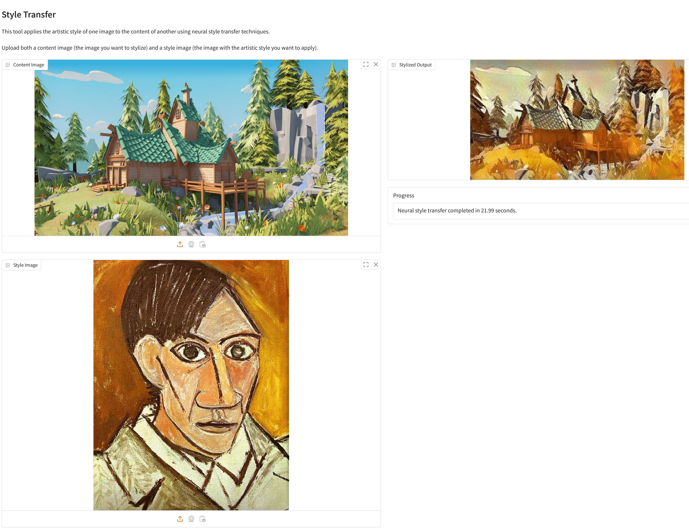
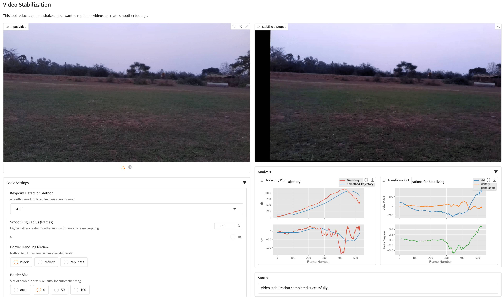
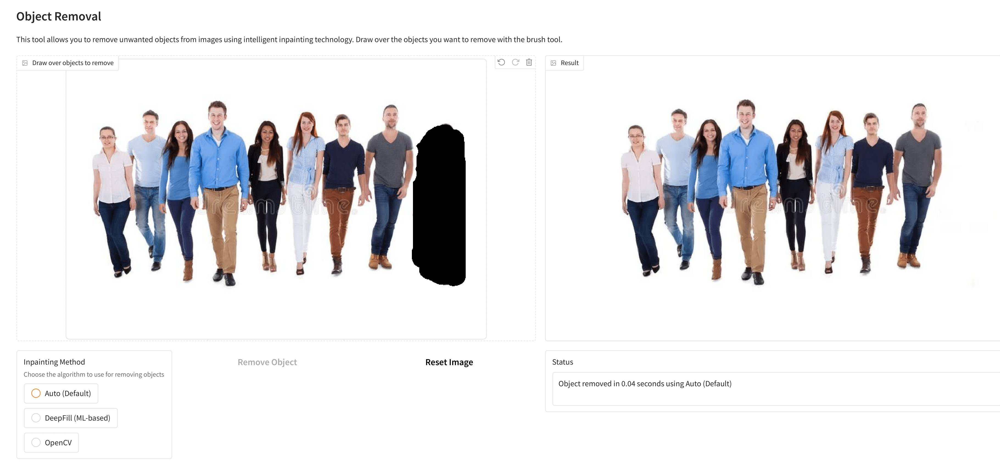

# ABSTRACT

The proliferation of digital media has led to an increasing demand for powerful yet accessible image and video editing tools. Traditional editing software often presents a steep learning curve, hindering casual users and content creators. This project, "VidStyler: AI-Powered Image and Video Editing," addresses this gap by developing an integrated suite that leverages artificial intelligence to simplify complex editing tasks. VidStyler offers three core functionalities: Neural Style Transfer (NST), Video Stabilization, and Object Removal.

Neural Style Transfer allows users to apply the artistic style of one image to the content of another, utilizing a VGG16 network for feature extraction and an L-BFGS optimization process to minimize content and style losses. Video Stabilization reduces camera shake and unwanted motion in videos by employing various keypoint detection algorithms (e.g., GFTT, SIFT, ORB) via the `vidstab` library, smoothing camera trajectories, and warping frames accordingly. Object Removal enables users to eliminate unwanted elements from images through intelligent inpainting; users can draw masks over objects, and the system uses either traditional OpenCV methods or advanced DeepFill (a TensorFlow-based deep learning model) to fill the occluded regions.

The entire suite is accessible through a user-friendly web interface built with Gradio, featuring separate tabs for each functionality and interactive controls for parameter adjustment. The project aims to make advanced media editing capabilities more accessible, enabling users to enhance their creative output with minimal technical expertise. This report details the project's background, literature survey, system architecture, design, implementation, testing, and results, showcasing a practical application of AI in multimedia editing.

Contents
Chapters Page No.

Abstract i
Contents ii
List of Figures iv
List of Tables v
Chapter 1 Introduction 1
1.1 Project Overview 1
1.2 Motivation 2
1.3 Problem Statement 3
1.4 Objectives 3
1.5 Overview of Neural Style Transfer 4
1.6 Overview of Video Stabilization 5
1.7 Overview of Object Removal 5
1.8 System Architecture Overview 6
1.9 Challenges Addressed 6
1.10 Summary 7
Chapter 2 Literature Survey 8
2.1 Image Style Transfer 8
2.2 Video Stabilization 9
2.3 Object Removal (Inpainting) 10
Chapter 3 System Analysis 11
3.1 Proposed System and Functional Requirements 11
3.2 Hardware Requirements 12
3.3 Software Requirements 12
3.4 Non-Functional Requirements 13
Chapter 4 Design 14
4.1 Purpose and Scope 14
4.1.1 Software Design Levels 14
4.2 System Architecture 15
4.2.1 High-Level Architecture 15
4.2.2 Module Breakdown 16
4.3 Use Case Model 17
4.4 Sequence Diagrams 18
4.4.1 Neural Style Transfer Sequence 18
4.4.2 Video Stabilization Sequence 19
4.4.3 Object Removal Sequence 20
Chapter 5 Implementation 21
5.1 User Interface (app/app.py) 21
5.2 Neural Style Transfer (src/style_transfer/) 22
5.3 Video Stabilization (src/video_stabilization/) 23
5.4 Object Removal (src/object_removal/) 24
5.5 Key Algorithms and Libraries 25
Chapter 6 Testing and Results 26
6.1 Testing Approach 26
6.1.1 Functional Testing 26
6.1.2 Usability Testing 26
6.2 Results and Discussion 27
6.2.1 Neural Style Transfer Results 27
6.2.2 Video Stabilization Results 28
6.2.3 Object Removal Results 29
6.2.4 Performance Observations 30
Conclusion and Future Work 31
References 33

## List of Figures

| Figure No. | Figure Name                                            | Page No. |
| :--------- | :----------------------------------------------------- | :------- |
| 4.1        | High-Level System Architecture of VidStyler            | 15       |
| 4.2        | Detailed Modular Architecture of VidStyler             | 16       |
| 4.3        | Use Case Diagram for VidStyler                         | 17       |
| 4.4        | Sequence Diagram for Neural Style Transfer             | 18       |
| 4.5        | Sequence Diagram for Video Stabilization               | 19       |
| 4.6        | Sequence Diagram for Object Removal                    | 20       |
| 6.1        | Neural Style Transfer UI and Example Output            | 27       |
| 6.2        | Video Stabilization UI and Example Output (with Plots) | 28       |
| 6.3        | Object Removal UI and Example Output                   | 29       |

## List of Tables

| Table No. | Table Name            | Page No. |
| :-------- | :-------------------- | :------- |
| 3.1       | Hardware Requirements | 12       |
| 3.2       | Software Requirements | 12       |

Chapter 1
INTRODUCTION
1.1 Project Overview
VidStyler is an AI-powered image and video editing suite designed to offer advanced editing functionalities using deep learning and computer vision techniques. The tool provides users with intelligent features for modifying and enhancing multimedia content efficiently. VidStyler aims to streamline complex editing processes with automation, making high-quality video and image editing accessible to all users regardless of technical expertise.

The suite integrates three main functionalities:

-   **Neural Style Transfer**: Applies artistic styles from a style image to a content image using deep neural networks.
-   **Video Stabilization**: Reduces unwanted shakiness and jitter in videos to produce smoother playback.
-   **Object Removal**: Enables users to seamlessly erase unwanted objects from images using inpainting techniques.

By leveraging state-of-the-art deep learning algorithms and computer vision techniques, VidStyler provides powerful editing capabilities through an intuitive Gradio-based web interface. This allows users to enhance their creative output with minimal technical knowledge or manual effort, democratizing access to sophisticated media manipulation tools.

1.2 Motivation
The development of VidStyler is driven by several key factors reflecting current trends in digital content creation and consumption:

1.  **Explosion of User-Generated Content**: The rise of social media platforms, vlogging, and digital marketing has led to a massive increase in the creation and sharing of visual content. This surge creates a demand for tools that can help individuals and small businesses produce high-quality, engaging media.
2.  **Accessibility of Editing Tools**: While professional-grade editing software offers extensive capabilities, it often comes with a steep learning curve and high cost, making it inaccessible to many. There's a growing need for powerful yet user-friendly tools that don't require specialized training.
3.  **Advancements in AI for Media**: Recent breakthroughs in artificial intelligence, particularly in deep learning and computer vision, have demonstrated remarkable potential for automating and enhancing complex editing tasks such as style transfer, motion analysis, and content-aware filling.
4.  **Demand for Specific, High-Impact Features**: Tasks like applying artistic styles, stabilizing shaky footage, and removing distracting objects are common pain points for content creators. Offering dedicated, effective solutions for these tasks can significantly improve workflow efficiency and output quality.
5.  **Bridging the Gap**: VidStyler aims to bridge the gap between cutting-edge AI research and practical application, translating complex algorithms into accessible tools that empower users to achieve professional-looking results without being AI experts.

VidStyler addresses these motivations by providing a unified platform that integrates these AI-driven functionalities, making sophisticated editing more approachable.

1.3 Problem Statement
Traditional image and video editing often involves complex, time-consuming manual processes requiring significant technical skill and specialized software. Tasks such as applying artistic styles, stabilizing shaky video footage, or seamlessly removing unwanted objects from an image can be laborious and challenging for non-expert users, often leading to suboptimal results or abandonment of creative ideas. This creates a barrier for many individuals and small-scale content creators who wish to produce high-quality, polished visual media.

VidStyler aims to address this problem by developing an AI-powered editing suite that automates and simplifies these complex tasks. The goal is to provide an intuitive, integrated platform where users can achieve sophisticated edits like neural style transfer, robust video stabilization, and intelligent object removal with minimal effort and technical knowledge, thereby democratizing access to advanced media editing capabilities.

1.4 Objectives
The primary goal of VidStyler is to develop an integrated, AI-powered image and video editing suite that is both powerful and accessible to a wide range of users. The specific objectives to achieve this goal are:

1.  **Implement Neural Style Transfer (NST)**:
    -   Develop a robust NST module capable of transferring artistic styles from a style image to a content image.
    -   Utilize pre-trained Convolutional Neural Networks (e.g., VGG16) for feature extraction.
    -   Employ an optimization-based approach (e.g., L-BFGS) to minimize content and style losses.
    -   Provide user controls for style and content weighting, and iteration count.
2.  **Develop Video Stabilization**:
    -   Implement a video stabilization module to reduce camera shake and unwanted motion.
    -   Support multiple keypoint detection methods (e.g., GFTT, SIFT, ORB) for feature tracking.
    -   Allow customization of smoothing radius and border handling techniques.
    -   Optionally, include advanced features like layer effects and trajectory visualization.
3.  **Enable Intelligent Object Removal**:
    -   Create an object removal module that allows users to seamlessly remove unwanted elements from images.
    -   Provide an interactive masking tool for users to specify regions for removal.
    -   Implement both traditional (e.g., OpenCV-based) and deep learning-based (e.g., DeepFill) inpainting algorithms.
4.  **Create an Intuitive User Interface (UI)**:
    -   Design and build a user-friendly web interface using Gradio.
    -   Organize functionalities into clear, accessible tabs.
    -   Provide intuitive controls for uploading media, adjusting parameters, and viewing results.
5.  **Ensure Practical Performance and Usability**:
    -   Optimize algorithms for reasonable processing times on standard consumer hardware.
    -   Handle common image and video formats.
    -   Provide clear feedback and status updates to the user during processing.
6.  **Modular and Maintainable Codebase**:
    -   Structure the project with clear separation of concerns for UI, core logic of each feature, and utilities.
    -   Document the implementation and functionalities for clarity and future development.

1.5 Overview of Neural Style Transfer
Neural Style Transfer (NST) is a captivating application of deep learning that allows for the artistic style of one image (the "style image") to be applied to the content of another image (the "content image"), producing a new, stylized image. The pioneering work by Gatys et al. (2015) demonstrated that Convolutional Neural Networks (CNNs), pre-trained for object recognition tasks (like VGG networks), learn hierarchical feature representations that can effectively separate and recombine image content and style.

**Core Concepts:**

1.  **Content Representation**: The content of an image refers to its high-level structure and the objects depicted. In a CNN, deeper layers capture these abstract features, discarding fine textural details. The content loss is typically calculated as the Mean Squared Error (MSE) between the feature map activations of the content image and the generated image at a specific deeper layer (e.g., `relu3_3` or `relu4_2` in VGG).
2.  **Style Representation**: The style of an image encompasses its textures, colors, brushstrokes, and overall artistic patterns. This is captured by correlations between feature responses in different layers of the CNN. The Gram matrix, which computes the dot products between vectorized feature maps, is used to represent these correlations. The style loss is the MSE between the Gram matrices of the style image and the generated image, often summed across multiple layers to capture style at different scales.
3.  **Optimization Process**: NST is typically an optimization problem. Starting with an initial image (often a copy of the content image or random noise), the image is iteratively updated to minimize a total loss function, which is a weighted sum of the content loss and the style loss. An optimizer like L-BFGS is commonly used for this iterative refinement.

VidStyler implements this optimization-based NST, allowing users to upload content and style images and adjust parameters like style weight, content weight, and the number of optimization iterations to control the final artistic output.

1.6 Overview of Video Stabilization
Video stabilization is the process of reducing unwanted camera motion or shake from a video sequence to produce smoother, more visually appealing footage. Shaky videos, often captured by handheld devices or cameras in motion, can be distracting and reduce the perceived quality of the content. The goal of video stabilization is to differentiate between intentional camera movements (like panning or tilting) and unintentional jitter, and then to compensate for the latter.

**Typical Stages in Video Stabilization:**

1.  **Motion Estimation**: This involves analyzing consecutive frames to determine how the camera (or scene) has moved. Common techniques include:
    -   **Keypoint Tracking**: Identifying and tracking distinctive points (features) across frames using algorithms like GFTT, SIFT, SURF, or ORB. The displacement of these points helps estimate the inter-frame motion.
    -   **Optical Flow**: Estimating the motion of every pixel or blocks of pixels between frames.
    -   The result is often a series of transformation matrices (e.g., affine, homography) representing the raw camera path.
2.  **Motion Smoothing**: The raw camera path is often noisy and shaky. This path is smoothed using techniques like:
    -   **Moving Average Filter**: Averaging transformations over a temporal window.
    -   **Gaussian Filter**: Applying a Gaussian weighted average.
    -   More advanced methods involve Kalman filtering or other optimization techniques to derive a smoother target camera path.
3.  **Frame Warping (Compensation)**: Once a smoothed path is obtained, the original frames are warped (transformed) to align with this new, stable path. This might involve translation, rotation, scaling, or more complex transformations.
    -   **Border Handling**: Warping frames often results in empty areas around the borders. These can be filled with black, by reflecting/replicating edge pixels, or by cropping the video (dynamic zooming).

VidStyler utilizes the `vidstab` library, which encapsulates these steps. It allows users to select keypoint detection methods, adjust the smoothing radius (window size for the moving average), and choose border handling techniques to achieve the desired stabilization effect.

1.7 Overview of Object Removal
Object removal, often referred to as inpainting or content-aware fill, is the task of intelligently filling in a selected region of an image (typically an unwanted object) with new content that is visually plausible and consistent with the surrounding areas. The challenge lies in generating realistic textures and structures that seamlessly blend with the rest of the image, making the removal undetectable.

**Approaches to Object Removal/Inpainting:**

1.  **Traditional/Classical Methods**:
    -   **Diffusion-based**: These methods propagate information from the boundary of the hole inwards, typically by solving partial differential equations (PDEs) that model a diffusion process (e.g., Navier-Stokes, Telea's method). They are good for filling small, narrow regions or scratches.
    -   **Patch-based (Exemplar-based)**: These methods search for the most similar patches in the known part of the image and copy them into the target region. They can reconstruct textures and simple structures well but may struggle with complex, unique content.
2.  **Deep Learning-based Methods**:
    -   **Convolutional Neural Networks (CNNs)**: Modern approaches often use deep CNNs, particularly autoencoder-like architectures or Generative Adversarial Networks (GANs), trained on large datasets of images with missing regions. These models learn to understand image context and generate semantically meaningful and realistic fillings.
    -   **DeepFill (and its variants)**: A well-known deep learning architecture for inpainting that uses gated convolutions and contextual attention mechanisms to handle holes of arbitrary shapes and generate high-quality results, especially for larger and more complex regions.

VidStyler's object removal tab allows users to draw a mask over the object they wish to remove using the `ImageEditor` component. It then offers a choice between:

-   **OpenCV-based methods**: Leveraging traditional techniques like Navier-Stokes (cv2.INPAINT_NS) or Telea (cv2.INPAINT_TELEA) for faster, simpler inpainting.
-   **DeepFill**: Utilizing a pre-trained TensorFlow-based DeepFill model for more sophisticated, context-aware inpainting, which can yield better results for complex scenes but is more computationally intensive.

1.8 System Architecture Overview
VidStyler is designed with a modular architecture to ensure clarity, maintainability, and scalability. The system is primarily composed of a frontend user interface and a backend processing engine.

1.  **Frontend User Interface (UI)**:

    -   Built using **Gradio**, a Python library for creating customizable UI components for machine learning models.
    -   `app/app.py` is the main file defining the UI structure. It organizes the application into three distinct tabs: "Style Transfer," "Video Stabilization," and "Object Removal."
    -   Each tab contains input components (image/video uploads, sliders for parameters, dropdowns, radio buttons) and output components (image/video displays, text boxes for status/progress).
    -   The UI handles user interactions and triggers the corresponding backend processing functions.

2.  **Backend Processing Engine (`src/` directory)**:

    -   This is where the core logic for each feature resides, separated into distinct modules:
        -   **`src/style_transfer/`**: Contains `neural_style.py` (implements the L-BFGS based NST using PyTorch and VGG16), `models.py` (VGG16 model definition), and `utils.py` (helper functions like Gram matrix calculation).
        -   **`src/video_stabilization/`**: Includes `stabilize.py` (acts as a high-level function called by Gradio, orchestrating stabilization) and `vidstab.py` (a wrapper around the external `vidstab` library, simplifying its use and handling plotting).
        -   **`src/object_removal/`**: Features `inpainting.py` (main logic for object removal, selecting between OpenCV and DeepFill), `deepfill_inpainter.py` (manages the DeepFill TensorFlow model, its loading, and inference), and `model/` (containing the DeepFill model architecture).
    -   These backend modules use libraries like PyTorch, TensorFlow, OpenCV, NumPy, and `vidstab` to perform the computationally intensive tasks.

3.  **Application Entry Point (`run.py`)**:
    -   This script initializes the Gradio application by calling `create_ui()` from `app/app.py` and launches the web server. It also sets up necessary system paths.

**Data Flow**:

-   Users interact with the Gradio UI, uploading media and setting parameters.
-   Gradio calls the respective Python functions in `app/app.py` (e.g., `process_neural_style_transfer`, `stabilize_video`, `process_removal`).
-   These functions, in turn, call the core logic functions from the `src/` modules.
-   The backend modules process the media and return the results (stylized images, stabilized videos, inpainted images, plots) and status messages.
-   Gradio updates the UI to display these outputs to the user.

This separation allows for independent development and testing of the UI and the core AI functionalities.

1.9 Challenges Addressed
The development and implementation of VidStyler aim to address several common challenges in the field of digital media editing, particularly when leveraging AI techniques:

1.  **Accessibility and Usability**:

    -   **Challenge**: Advanced editing techniques and AI models often require specialized knowledge, command-line interfaces, or complex software setups, making them inaccessible to non-expert users.
    -   **VidStyler's Approach**: Provides a unified, intuitive Gradio-based web interface that abstracts the underlying complexity. Users can access powerful features through simple controls like image uploads, sliders, and buttons.

2.  **Computational Intensity**:

    -   **Challenge**: Many AI-driven editing processes, such as iterative neural style transfer or deep learning-based inpainting, are computationally expensive and can be slow on consumer hardware.
    -   **VidStyler's Approach**: While not eliminating this entirely, it offers choices (e.g., OpenCV vs. DeepFill for inpainting) that allow users to balance quality and speed. It also provides progress indicators for longer tasks.

3.  **Integration of Multiple Tools**:

    -   **Challenge**: Users often need to switch between different specialized software for various editing tasks (e.g., one for style transfer, another for stabilization), leading to disjointed workflows.
    -   **VidStyler's Approach**: Integrates three distinct, high-demand editing functionalities (NST, video stabilization, object removal) into a single application suite.

4.  **Parameter Tuning Complexity**:

    -   **Challenge**: AI models can have many hyperparameters that significantly affect the output, and finding optimal settings can be difficult for users.
    -   **VidStyler's Approach**: Exposes key, understandable parameters (e.g., style weight, smoothing radius) with sensible defaults and informative labels/tooltips, allowing for customization without overwhelming the user.

5.  **Reproducibility and Control**:

    -   **Challenge**: Achieving consistent results or fine-tuning outputs from AI models can be difficult.
    -   **VidStyler's Approach**: For NST, parameters like weights and iterations give users control. For stabilization, various keypoint detectors and smoothing options are available. For object removal, different inpainting methods are offered.

6.  **Handling Diverse Inputs**:
    -   **Challenge**: Media files come in various formats, resolutions, and qualities, which can affect the performance of AI algorithms.
    -   **VidStyler's Approach**: Leverages robust libraries like OpenCV and Pillow for media handling and incorporates preprocessing steps (e.g., image resizing in NST) to manage input variability.

By tackling these challenges, VidStyler aims to make AI-powered media editing more practical, efficient, and accessible.

1.10 Summary
This chapter introduced VidStyler, an AI-powered image and video editing suite designed to make sophisticated media manipulation accessible to a broad audience. The project's core motivation stems from the increasing demand for powerful yet user-friendly editing tools in an era of prolific digital content creation, coupled with the transformative potential of AI in automating and enhancing such tasks. VidStyler integrates three key functionalities: Neural Style Transfer for artistic image transformation, Video Stabilization for smoothing shaky footage, and Object Removal for seamlessly erasing unwanted elements from images.

The problem VidStyler addresses is the complexity and skill barrier associated with traditional editing software. The primary objectives are to implement these three core AI-driven features, package them within an intuitive Gradio-based web interface, and ensure practical performance. Brief overviews of the underlying principles of Neural Style Transfer (using CNNs and optimization), Video Stabilization (feature tracking, motion smoothing, and frame warping), and Object Removal (inpainting via traditional and deep learning methods) were provided.

The system architecture is modular, separating the Gradio UI (in `app/app.py`) from the backend processing logic housed in the `src/` directory, which contains dedicated modules for each feature. This design aims to tackle challenges related to accessibility, computational intensity, tool integration, and parameter tuning. By offering a unified platform, VidStyler endeavors to empower users to create high-quality, polished visual media with greater ease and efficiency. The subsequent chapters will delve into the existing research landscape, detailed system analysis, design considerations, implementation specifics, and the evaluation of VidStyler's performance.

CHAPTER 2
LITERATURE SURVEY

This chapter reviews existing research and techniques relevant to the core functionalities of VidStyler: Image Style Transfer, Video Stabilization, and Object Removal (Inpainting).

2.1 Image Style Transfer
Image Style Transfer aims to render the content of one image in the artistic style of another.

-   **Early Non-Photorealistic Rendering (NPR) Techniques**: Before deep learning, methods for artistic rendering included stroke-based rendering, which simulated brush strokes, and image filtering techniques to achieve effects like watercolor or impressionism. Texture synthesis and image analogies (Hertzmann et al., 2001) were also explored to transfer visual appearance. These methods often required significant parameter tuning or manual intervention.

-   **Neural Style Transfer (Gatys et al., 2015)**: The seminal work "A Neural Algorithm of Artistic Style" by Gatys, Ecker, and Bethge revolutionized the field. They demonstrated that deep Convolutional Neural Networks (CNNs), specifically VGG networks pre-trained on ImageNet, could separate and recombine the content and style of images.

    -   **Content Representation**: Captured by the feature responses in the higher layers of a CNN.
    -   **Style Representation**: Captured by the correlations between feature responses across different channels, represented by Gram matrices, typically extracted from multiple layers of the CNN.
    -   **Process**: An optimization process (often using L-BFGS) iteratively modifies an initial image (e.g., content image or white noise) to minimize a weighted sum of content loss (difference between content features) and style loss (difference between Gram matrices). This method produces high-quality results but is computationally intensive and slow (optimization-based).

-   **Fast Neural Style Transfer (Johnson et al., 2016; Ulyanov et al., 2016)**: To address the speed limitations of the optimization-based approach, researchers proposed training feed-forward neural networks (often called "style transfer networks" or "image transformation networks").

    -   These networks are trained to transform any content image into a specific style. Once trained, applying the style is very fast (a single forward pass).
    -   The training involves minimizing perceptual loss functions similar to those used by Gatys et al., calculated by passing the network's output and target images through a pre-trained loss network (e.g., VGG).
    -   A limitation is that a separate network needs to be trained for each new style.

-   **Arbitrary Style Transfer / Universal Style Transfer**: The next advancement aimed to allow fast style transfer using any arbitrary style image without retraining.

    -   **AdaIN (Adaptive Instance Normalization) (Huang and Belongie, 2017)**: Proposed aligning the mean and variance of content features with those of style features in the feature space. This simple yet effective technique allows for real-time arbitrary style transfer.
    -   **Whitening and Coloring Transform (WCT) (Li et al., 2017)**: Another approach that stylizes content features by matching their second-order statistics (covariance) to those of the style features.
    -   Attention mechanisms (e.g., SANet, Park and Lee, 2019) and other feature alignment techniques have further improved the quality and flexibility of arbitrary style transfer.

-   **GAN-based Style Transfer**: Generative Adversarial Networks (GANs) have also been applied, for example, in CycleGAN (Zhu et al., 2017) for unpaired image-to-image translation, which can be adapted for style transfer tasks where paired data is unavailable.

VidStyler implements the original optimization-based approach (Gatys et al.) for its Neural Style Transfer feature, prioritizing quality and flexibility in controlling the style/content balance, though it is computationally more demanding than feed-forward methods.

2.2 Video Stabilization
Video stabilization aims to remove undesirable camera shakes and jitters from video sequences.

-   **2D Electronic Image Stabilization (EIS)**: These are common in consumer cameras and smartphones. They typically estimate global motion (e.g., affine or homography) between frames and then smooth this motion.

    -   **Feature-based methods**: Track salient feature points (e.g., SIFT, SURF, ORB, GFTT) across frames. The motion of these points is used to estimate the camera's motion.
    -   **Motion Smoothing**: The estimated camera trajectory (a sequence of transformations) is smoothed using filters like moving average, Gaussian, or Kalman filters.
    -   **Image Warping**: Frames are warped according to the difference between the original and smoothed trajectories. This often results in blank areas at the borders, which are handled by cropping or inpainting. The `vidstab` library, used in VidStyler, largely follows this paradigm.

-   **2.5D and 3D Video Stabilization**:

    -   **2.5D**: Some methods attempt to model parallax by dividing the scene into layers or using depth information.
    -   **3D Methods**: These methods reconstruct the 3D camera path and scene geometry (Structure from Motion - SfM). They can provide very high-quality stabilization but are computationally expensive and complex. Examples include an early work by Buehler et al. (2001) on unstructured video.

-   **Optical Flow Based Methods**: Instead of sparse features, dense optical flow can be used to estimate motion. However, this can be computationally intensive and sensitive to illumination changes.

-   **Content-Preserving Warping (Liu et al., 2013)**: Some advanced methods aim to minimize distortions in the stabilized video by using content-aware warping techniques, trying to preserve straight lines and reduce perspective distortions.

-   **Deep Learning for Video Stabilization**: More recent approaches use deep learning.
    -   **Learning to Predict Transformations**: CNNs can be trained to predict stabilizing transformations directly from pairs of frames or short video clips.
    -   **Unsupervised or Self-Supervised Learning**: Training models without explicitly stabilized ground truth, for example, by enforcing consistency in appearance or motion.
    -   **StabNet (Wang et al., 2018)**: An example of a deep learning approach that estimates homographies for stabilization.

VidStyler uses the `vidstab` library, which primarily relies on 2D feature-based motion estimation and trajectory smoothing, offering a good balance between effectiveness and computational feasibility for a general-purpose tool.

2.3 Object Removal (Inpainting)
Object removal, or inpainting, is the process of filling in missing or unwanted regions in an image in a visually plausible manner.

-   **Traditional Inpainting Methods**:

    -   **Diffusion-based (Bertalmio et al., 2000; Telea, 2004)**: These methods propagate information from the boundary of the missing region inwards using techniques inspired by partial differential equations (PDEs). For example, Telea's method uses a fast marching approach. They are good for small, narrow regions or scratches but tend to blur larger areas or fail to reconstruct complex textures. OpenCV implements these (e.g., `cv2.INPAINT_NS`, `cv2.INPAINT_TELEA`).
    -   **Patch-based / Exemplar-based (Criminisi et al., 2004)**: These methods search for similar patches in the known part of the image and copy them into the unknown region. The order of filling is often determined by a priority term. They are better at reconstructing textures and structures than diffusion methods but can be slow and may produce repetitive patterns or artifacts if suitable patches are not found.

-   **Deep Learning-based Inpainting**: These methods have shown significantly superior results, especially for large missing regions and complex scenes.

    -   **Context Encoders (Pathak et al., 2016)**: An early deep learning approach using an encoder-decoder architecture with an adversarial loss to learn to fill in missing regions.
    -   **Globally and Locally Consistent Image Completion (Iizuka et al., 2017)**: Used two discriminator networks (global and local) to ensure consistency.
    -   **DeepFill & DeepFill v2 (Yu et al., 2018, 2019)**: A prominent architecture that introduced gated convolutions (to handle irregular holes better) and contextual attention mechanisms. The attention module explicitly borrows or copies feature information from distant spatial locations, allowing for better handling of complex structures and textures. DeepFill v2 improved upon this with better attention mechanisms. This is the ML-based method offered in VidStyler.
    -   **GAN-based methods**: Many deep learning inpainting methods leverage Generative Adversarial Networks (GANs) to produce sharper and more realistic results. The generator network tries to fill the hole, and the discriminator network tries to distinguish between real images and inpainted ones.

-   **Specialized Inpainting**:
    -   **Face Inpainting**: Models specifically trained for completing faces.
    -   **Object Removal vs. General Inpainting**: While general inpainting fills any hole, object removal often implies a semantic understanding that an object _was_ there and needs to be replaced by plausible background.

VidStyler provides both traditional OpenCV-based inpainting (fast, for simple cases) and the more advanced DeepFill method (TensorFlow-based, better for complex scenes), offering users a choice based on their needs and the complexity of the removal task.

CHAPTER 3
SYSTEM ANALYSIS

This chapter details the analysis of the VidStyler system, covering its functional requirements, hardware and software prerequisites, and other non-functional considerations.

3.1 Proposed System and Functional Requirements
VidStyler is an AI-powered image and video editing suite designed to provide users with advanced editing capabilities through an intuitive interface. The system integrates three core functionalities:

**1. Neural Style Transfer (NST):**

-   **FR1.1**: Allow users to upload a content image and a style image.
-   **FR1.2**: Apply the artistic style of the style image to the content image.
-   **FR1.3**: Utilize a VGG16 pre-trained model for feature extraction from both images.
-   **FR1.4**: Compute Gram matrices from style image features to represent artistic style.
-   **FR1.5**: Employ an L-BFGS optimization algorithm to iteratively generate the stylized image by minimizing content loss and style loss.
-   **FR1.6**: Allow users to adjust parameters:
    -   Style Weight: Control the intensity of the applied style.
    -   Content Weight: Control the preservation of the original content structure.
    -   Iterations: Define the number of optimization steps for quality refinement.
-   **FR1.7**: Display the resulting stylized image.
-   **FR1.8**: Provide progress feedback during the computationally intensive stylization process.

**2. Video Stabilization:**

-   **FR2.1**: Allow users to upload a video file.
-   **FR2.2**: Reduce camera shake and unwanted motion to produce a smoother video.
-   **FR2.3**: Support multiple keypoint detection methods for feature tracking (e.g., GFTT, SIFT, SURF, ORB, BRISK, FAST).
-   **FR2.4**: Allow users to customize the smoothing radius (frames) to control the degree of stabilization.
-   **FR2.5**: Provide options for border handling (e.g., "black," "reflect," "replicate") to manage edges resulting from stabilization.
-   **FR2.6**: Allow users to specify border size (fixed pixel value or "auto").
-   **FR2.7 (Optional)**: Implement advanced layer effects (e.g., "overlay" for trails, "blend" for motion blur) with adjustable parameters like alpha for blending.
-   **FR2.8 (Optional)**: Display trajectory plots (original vs. smoothed) and transform plots for analysis.
-   **FR2.9**: Output the stabilized video file.
-   **FR2.10**: Provide status updates during the stabilization process.

**3. Object Removal (Inpainting):**

-   **FR3.1**: Allow users to upload an image.
-   **FR3.2**: Provide an interactive image editor where users can draw a mask over unwanted objects using a brush tool.
-   **FR3.3**: Implement inpainting algorithms to fill the masked regions seamlessly.
-   **FR3.4**: Offer multiple inpainting methods:
    -   OpenCV-based: Traditional, faster methods (e.g., Navier-Stokes, Telea).
    -   DeepFill: ML-based (TensorFlow model) for more complex scenes and higher quality results.
    -   Auto (Default): Potentially a heuristic to choose between methods or a pre-set default.
-   **FR3.5**: Display the image with the selected objects removed.
-   **FR3.6**: Provide a "Reset Image" option to clear user drawings.
-   **FR3.7**: Provide status updates during the inpainting process.

**4. General User Interface (UI) and System Requirements:**

-   **FR4.1**: Provide a web-based UI accessible through a browser.
-   **FR4.2**: Organize the three core functionalities into distinct, clearly labeled tabs.
-   **FR4.3**: Include clear instructions and tips for using each feature.
-   **FR4.4**: Ensure responsive feedback for user actions.

3.2 Hardware Requirements
To effectively run VidStyler, especially its computationally intensive AI modules, the following minimum and recommended hardware specifications are suggested:

**Table 3.1 Hardware Requirements**

| Component           | Minimum Specification                          | Recommended Specification                                              | Notes                                                                |
| ------------------- | ---------------------------------------------- | ---------------------------------------------------------------------- | -------------------------------------------------------------------- |
| **Processor (CPU)** | Multi-core (e.g., Intel i5 4th Gen equivalent) | Modern Multi-core (e.g., Intel i5 11th Gen+, AMD Ryzen 5 3000 series+) | Faster CPU improves general responsiveness and non-GPU tasks.        |
| **RAM**             | 8 GB                                           | 16 GB or more                                                          | More RAM is crucial for handling larger images/videos and ML models. |
| **Storage**         | 50 GB free space (HDD)                         | 100 GB free space (SSD)                                                | SSD significantly improves model loading times and file operations.  |
| **GPU**             | Not strictly required (CPU fallback)           | NVIDIA CUDA-enabled GPU (e.g., GTX 1650+, RTX series) with 4GB+ VRAM   | Highly recommended for NST and DeepFill for acceptable performance.  |
| **Display**         | 1366x768 resolution                            | 1920x1080 (Full HD) or higher                                          | For better viewing of UI and media.                                  |
| **Network**         | -                                              | Stable internet (for initial setup/dependencies)                       | Local execution primarily.                                           |

3.3 Software Requirements
VidStyler relies on several software components and libraries. The development and execution environment should meet these requirements:

**Table 3.2 Software Requirements**

| Category             | Component/Library             | Version / Details                                       | Purpose                                                      |
| -------------------- | ----------------------------- | ------------------------------------------------------- | ------------------------------------------------------------ |
| **Operating System** | Windows, macOS, Linux         | Windows 10/11, recent macOS, common Linux distributions | Platform for running the application.                        |
| **Python**           | Python                        | 3.8+ (specifically tested around 3.10)                  | Core programming language.                                   |
| **Deep Learning**    | PyTorch                       | 1.8+ (e.g., with CUDA support if GPU is used)           | For Neural Style Transfer (VGG16, optimization).             |
|                      | TensorFlow                    | 1.x or 2.x with compat.v1 (as used by DeepFill model)   | For DeepFill object removal.                                 |
| **Computer Vision**  | OpenCV (cv2)                  | 4.5+                                                    | Image/video processing, traditional inpainting, GUI support. |
| **UI Framework**     | Gradio                        | 2.0+ (latest stable recommended)                        | For building the web-based user interface.                   |
| **Video Processing** | vidstab                       | Latest stable version                                   | For video stabilization.                                     |
| **Core Libraries**   | NumPy                         | Latest stable version                                   | Numerical operations, array manipulation.                    |
|                      | Pillow (PIL Fork)             | Latest stable version                                   | Image file I/O and manipulation.                             |
|                      | Matplotlib                    | Latest stable version                                   | For generating plots in video stabilization.                 |
|                      | SciPy                         | Latest stable version                                   | Used by some underlying libraries or for optimization.       |
| **Development**      | IDE (e.g., VS Code, PyCharm)  | -                                                       | Recommended for development.                                 |
|                      | Git                           | -                                                       | For version control.                                         |
| **Web Browser**      | Chrome, Firefox, Edge, Safari | Modern versions                                         | For accessing the Gradio UI.                                 |

Dependencies are managed through `requirements.txt`.

3.4 Non-Functional Requirements
Beyond the specific functionalities, VidStyler should also meet several non-functional requirements:

-   **NFR1 (Usability)**: The application shall be intuitive and easy to use, even for users with limited technical expertise in image/video editing or AI. Clear instructions and feedback should be provided.
-   **NFR2 (Performance)**:
    -   UI Responsiveness: The Gradio interface should respond promptly to user inputs.
    -   Processing Time: While AI tasks can be intensive:
        -   OpenCV-based object removal should complete within seconds for typical image sizes.
        -   Video stabilization processing time should be proportional to video length and resolution, aiming for reasonable completion times.
        -   Neural Style Transfer and DeepFill object removal are known to be more time-consuming; the system should provide progress updates and manage user expectations. GPU acceleration should significantly improve these times.
-   **NFR3 (Reliability)**: The application should handle common errors gracefully (e.g., invalid file uploads, failed processing) and provide informative error messages to the user rather than crashing.
-   **NFR4 (Maintainability)**: The codebase should be well-structured, modular, and adequately commented to facilitate future updates, bug fixes, and feature enhancements.
-   **NFR5 (Scalability - System Level)**: While primarily a local application, the design should be such that individual modules could potentially be scaled or offloaded if deployed in a different environment (e.g., cloud-based).
-   **NFR6 (Modularity)**: The three main functionalities (NST, Stabilization, Object Removal) should be implemented as distinct modules, allowing for independent development, testing, and updates.
-   **NFR7 (Feedback)**: The system must provide adequate feedback to the user, including status messages during processing, progress indicators for long-running tasks, and clear display of results.

This system analysis provides a foundation for the design and implementation phases, ensuring that VidStyler meets both its functional goals and quality attributes.

CHAPTER 4

DESIGN

4.1 Purpose and Scope
This chapter outlines the design of the VidStyler system. The design process translates the requirements identified in the System Analysis phase into a blueprint for constructing the software. It covers the high-level architecture, modular breakdown, and dynamic interactions within the system.

**Purpose**:

-   To define the overall structure of VidStyler.
-   To specify the components (modules) of the system and their responsibilities.
-   To describe the interactions and interfaces between these components.
-   To provide a clear guide for the implementation phase.

**Scope**:
The design encompasses:

-   The architectural style and patterns used.
-   The breakdown of the application into logical modules for UI, Neural Style Transfer, Video Stabilization, and Object Removal.
-   Data flow between the UI and backend processing modules.
-   Key data structures and algorithms at a high level.
-   User interaction models (Use Cases and Sequence Diagrams).

4.1.1 Software Design Levels
Software design is typically approached in layers of abstraction:

-   **Architectural Design (High-Level Design)**: This is the highest level, defining the overall system structure, major components, and their relationships and interactions. It focuses on how the system will be partitioned and how these partitions will communicate. For VidStyler, this involves defining the UI layer, the backend processing layer, and the individual AI-feature modules.
-   **Detailed Design (Low-Level Design)**: This level elaborates on the architectural components, specifying the internal logic of each module, data structures, algorithms, and interface details. For VidStyler, this would involve defining the specific classes and functions within `neural_style.py` or `inpainting.py`, the parameters they accept, and the outputs they produce.

This chapter will primarily focus on the architectural and high-level design of VidStyler.

4.2 System Architecture
VidStyler employs a modular, layered architecture to separate concerns and promote maintainability.

4.2.1 High-Level Architecture
The system can be visualized as having two main layers:

1.  **Presentation Layer (User Interface)**: Handles user interaction, input gathering, and result display.
    -   Implemented using **Gradio**.
    -   File: `app/app.py`.
2.  **Application Logic/Processing Layer (Backend)**: Contains the core AI and image/video processing functionalities.
    -   Implemented as Python modules within the `src/` directory.
    -   Sub-modules for Neural Style Transfer, Video Stabilization, and Object Removal.

**Interaction Flow**:
User interacts with Gradio UI -> Gradio calls functions in `app.py` -> `app.py` functions call core logic in `src/` modules -> `src/` modules perform processing -> Results returned to `app.py` -> Gradio UI updates.

_Figure 4.1 High-Level System Architecture of VidStyler_

4.2.2 Module Breakdown
The system is broken down into the following key modules:

1.  **`app/app.py` (UI Application Core)**:

    -   Responsibilities:
        -   Defines the Gradio interface structure (Tabs, Rows, Columns, Input/Output components).
        -   Creates separate UI sections for Style Transfer, Video Stabilization, and Object Removal.
        -   Handles user inputs (file uploads, slider changes, button clicks).
        -   Invokes the appropriate backend processing functions from the `src` modules.
        -   Updates the UI with outputs (processed images/videos, plots, status messages).
        -   Manages visibility and interactivity of UI elements.

2.  **`src/style_transfer/` (Neural Style Transfer Module)**:

    -   `neural_style.py`: Contains the main logic for NST.
        -   Loads content and style images.
        -   Initializes the VGG16 model.
        -   Defines content and style loss functions.
        -   Runs the L-BFGS optimization loop.
        -   Manages image normalization/denormalization.
    -   `models.py`: Defines the VGG16 network class (adapted from `torchvision`) for feature extraction. May also contain other model architectures if extended (e.g., TransformerNet, though not primarily used for the L-BFGS approach).
    -   `utils.py`: Contains helper functions (e.g., Gram matrix calculation, image loading).

3.  **`src/video_stabilization/` (Video Stabilization Module)**:

    -   `stabilize.py`: High-level function called by the Gradio UI.
        -   Takes UI parameters (video path, kp_method, smoothing_radius, etc.).
        -   Instantiates and uses `VidStabWrapper`.
        -   Handles temporary file creation for outputs and plots.
        -   Orchestrates the stabilization process (transform generation, application, plotting).
    -   `vidstab.py`: A custom wrapper around the external `vidstab` library.
        -   Simplifies the `vidstab` API for VidStyler's needs.
        -   Manages transform generation, application, plotting, and layer effects.

4.  **`src/object_removal/` (Object Removal Module)**:

    -   `inpainting.py`: Central script for object removal.
        -   Receives the image and user-drawn mask (derived in `app.py`).
        -   Selects the inpainting method (OpenCV or DeepFill) based on user choice.
        -   Calls the appropriate inpainting function.
        -   Preprocesses image/mask and postprocesses results.
    -   `deepfill_inpainter.py`: Manages the DeepFill model.
        -   Loads the pre-trained TensorFlow DeepFill model.
        -   Prepares image and mask for model input.
        -   Runs inference.
        -   Postprocesses the output.
    -   `model/model.py`: Defines the neural network architecture for the DeepFill model.

5.  **`run.py` (Application Launcher)**:

    -   Sets up system paths.
    -   Imports `create_ui` from `app.py`.
    -   Launches the Gradio application.

6.  **External Libraries/Models**:
    -   PyTorch, torchvision: For NST (VGG16).
    -   TensorFlow: For DeepFill object removal model.
    -   OpenCV-Python: General image/video I/O, processing, OpenCV inpainting.
    -   Vidstab: Core video stabilization library.
    -   NumPy, Matplotlib, Pillow: Utility libraries.

This modular design allows for independent development, testing, and modification of each part of the system.

_Figure 4.2 Detailed Modular Architecture of VidStyler_

4.3 Use Case Model
A use case model describes the system's functionality from a user's perspective. The primary actor is the "User."

**Actor**: User

**Use Cases**:

1.  **UC1: Perform Neural Style Transfer**

    -   **Description**: User applies an artistic style from one image to another.
    -   **Steps**:
        1.  User navigates to the "Style Transfer" tab.
        2.  User uploads a content image.
        3.  User uploads a style image.
        4.  User adjusts style weight, content weight, and iteration parameters (optional).
        5.  User clicks "Apply Neural Style Transfer" button.
        6.  System processes the images and performs style transfer.
        7.  System displays the stylized output image and progress/status.
    -   **Includes**: Image Upload, Parameter Adjustment, Result Display.

2.  **UC2: Stabilize Video**

    -   **Description**: User reduces shakiness in a video.
    -   **Steps**:
        1.  User navigates to the "Video Stabilization" tab.
        2.  User uploads a video file.
        3.  User selects keypoint detection method, smoothing radius, border type, and border size (optional).
        4.  User enables/configures advanced effects like layer effects or plot generation (optional).
        5.  User clicks "Stabilize Video" button.
        6.  System processes the video and performs stabilization.
        7.  System displays the stabilized output video, trajectory/transform plots (if requested), and status.
    -   **Includes**: Video Upload, Parameter Adjustment, Result Display.

3.  **UC3: Remove Object from Image**
    -   **Description**: User removes an unwanted object from an image.
    -   **Steps**:
        1.  User navigates to the "Object Removal" tab.
        2.  User uploads an image to the editor.
        3.  User draws a mask over the object to be removed using the brush tool.
        4.  User selects an inpainting method (Auto, DeepFill, OpenCV).
        5.  User clicks "Remove Object" button.
        6.  System processes the image and performs inpainting.
        7.  System displays the output image with the object removed and status.
        8.  User can click "Reset Image" to clear mask and start over (optional).
    -   **Includes**: Image Upload, Mask Drawing, Method Selection, Result Display.

_Figure 4.3 Use Case Diagram for VidStyler_

4.4 Sequence Diagrams
Sequence diagrams illustrate the interactions between objects/components in a time sequence.

4.4.1 Neural Style Transfer Sequence

_Figure 4.4 Sequence Diagram for Neural Style Transfer_

4.4.2 Video Stabilization Sequence

_Figure 4.5 Sequence Diagram for Video Stabilization_

4.4.3 Object Removal Sequence

_Figure 4.6 Sequence Diagram for Object Removal_

This design chapter provides a comprehensive blueprint for developing VidStyler, detailing its architecture, modules, and key interactions.

CHAPTER 5

IMPLEMENTATION

This chapter describes the implementation details of the VidStyler application, focusing on the key modules and how they realize the functionalities defined in the design. The implementation leverages Python with libraries such as Gradio, PyTorch, TensorFlow, OpenCV, and Vidstab.

5.1 User Interface (`app/app.py`)
The user interface is the primary point of interaction for the user and is built using Gradio. The `app/app.py` file orchestrates the UI and connects frontend components to backend processing logic.

-   **Structure**:

    -   A `gr.Blocks()` context is used to define the overall application layout.
    -   A main title "VidStyler" and introductory markdown are displayed.
    -   `gr.Tabs()` are used to separate the three core functionalities: "Style Transfer," "Video Stabilization," and "Object Removal."
    -   Each tab is created by a dedicated function: `create_style_transfer_tab()`, `create_video_stabilization_tab()`, and `create_object_removal_tab()`.

-   **Style Transfer Tab (`create_style_transfer_tab`)**:

    -   Inputs: `gr.Image` for content and style images (type "numpy"), `gr.Slider` for style weight, content weight, and iterations.
    -   Button: `gr.Button("Apply Neural Style Transfer")`.
    -   Outputs: `gr.Image` for the stylized output, `gr.Textbox` for progress/status.
    -   Logic: The button's `click` event is connected to `process_neural_style_transfer` function, which calls the backend NST module.

-   **Video Stabilization Tab (`create_video_stabilization_tab`)**:

    -   Input: `gr.Video` for the input video.
    -   Settings:
        -   `gr.Dropdown` for keypoint detection method (`kp_method`).
        -   `gr.Slider` for smoothing radius.
        -   `gr.Radio` for border type and border size.
        -   `gr.Checkbox` to enable layer effects, with dependent `gr.Radio` (effect type) and `gr.Slider` (alpha) that become visible upon checking.
        -   `gr.Checkbox` to show trajectory plots.
    -   Button: `gr.Button("Stabilize Video")`.
    -   Outputs: `gr.Video` for stabilized output, two `gr.Image` components for trajectory and transforms plots, `gr.Textbox` for status.
    -   Logic: The button's `click` event is connected to `stabilize_video` (from `src.video_stabilization.stabilize`), which manages the stabilization process.

-   **Object Removal Tab (`create_object_removal_tab`)**:

    -   Input: `gr.ImageEditor` for uploading an image and drawing a mask. The `type` is "numpy". The `ImageEditor` provides both the original background and the composite image with drawings.
    -   Settings: `gr.Radio` for inpainting method ("Auto (Default)", "DeepFill (ML-based)", "OpenCV").
    -   Buttons: `gr.Button("Remove Object")`, `gr.Button("Reset Image")`.
    -   Outputs: `gr.Image` for the result, `gr.Textbox` for status.
    -   Logic:
        -   The "Remove Object" button's `click` event calls `process_removal`. This function:
            -   Extracts the background (original image) and composite (image with drawings) from the `ImageEditor`'s dictionary output.
            -   Computes a binary mask using `cv2.absdiff()` between composite and background, followed by grayscale conversion, thresholding, and dilation.
            -   Calls the `remove_object` function from `src.object_removal.inpainting` with the image, mask, and selected method.
        -   The "Reset Image" button's `click` event calls `reset_image`, which reloads the original background into the `ImageEditor`, effectively clearing drawings.

-   **Entry Point (`run.py`)**:
    -   Adds the project root to `sys.path`.
    -   Creates a "temp" directory if it doesn't exist (though not explicitly used by all modules, it's good practice for file operations).
    -   Calls `create_ui()` from `app/app.py` and launches the Gradio app using `app.launch()`.

5.2 Neural Style Transfer (`src/style_transfer/`)
This module is responsible for applying an artistic style to a content image.

-   **`neural_style.py`**:

    -   `apply_neural_style_transfer()`: This is the main public function called by the UI. It handles:
        -   Conversion of input NumPy arrays (BGR from OpenCV default) to RGB for processing.
        -   Calling the core `neural_style_transfer()` function.
        -   Converting the RGB result back to BGR.
    -   `neural_style_transfer()`: Implements the optimization loop.
        -   `load_image()`: Preprocesses input NumPy arrays into PIL Images, resizes them (max_size 512), and converts them to normalized PyTorch tensors.
        -   Model: `VGG16()` (from `models.py`) is loaded onto the selected device (CUDA or CPU).
        -   Optimizer: `optim.LBFGS` is used, targeting the `input_tensor` (initialized as a clone of the content tensor).
        -   Feature Extraction: Content features (from a specific layer, e.g., `relu3_3`) and style features (Gram matrices from multiple layers like `relu1_2`, `relu2_2`, `relu3_3`, `relu4_3`) are pre-calculated.
        -   Loss Calculation (`closure` function for L-BFGS):
            -   Content Loss: Mean Squared Error (MSE) between features of the generated image and original content image at the content layer.
            -   Style Loss: Weighted sum of MSE between Gram matrices of the generated image and original style image across several style layers.
            -   Total Loss = `content_weight * content_loss + style_weight * style_loss`.
        -   Optimization: The L-BFGS optimizer iteratively updates `input_tensor` to minimize total loss.
        -   Output: The final `input_tensor` is denormalized, converted to a NumPy array, and scaled to 0-255 uint8.
    -   Device: `torch.device("cuda" if torch.cuda.is_available() else "cpu")` ensures GPU usage if available.

-   **`models.py`**:

    -   `VGG16`: A PyTorch `nn.Module` class that wraps `models.vgg16(pretrained=True).features`. It's sliced into four parts (`slice1` to `slice4`) to easily extract intermediate layer activations (relu1_2, relu2_2, relu3_3, relu4_3). Parameters are frozen (`requires_grad=False`).
    -   `TransformerNet`, `ConvBlock`, `ResidualBlock`: These define a feed-forward network for fast style transfer. While present, the primary method used in `app.py` is the optimization-based VGG16 approach.

-   **`utils.py`**:
    -   `gram_matrix()`: Calculates the Gram matrix for a given feature map tensor.
    -   `denormalize()`: Reverses the normalization applied during image loading.
    -   `seed_everything()`: Ensures reproducibility.
    -   Other image loading/transform utilities (some might be redundant with `load_image` in `neural_style.py`).

5.3 Video Stabilization (`src/video_stabilization/`)
This module handles the reduction of camera shake in videos.

-   **`stabilize.py`**:

    -   `stabilize_video()`: This function is called directly by the Gradio UI.
        -   Takes video path and all stabilization parameters as input.
        -   Creates a temporary output path for the stabilized video.
        -   Initializes `VidStabWrapper` from `vidstab.py` with the selected `kp_method`.
        -   Sets up a `layer_func` if `use_layer_effect` is true (either `get_layer_overlay` or a `custom_blend` function capturing `layer_alpha`).
        -   Calls `stabilizer.gen_transforms()` to compute transformations.
        -   Calls `stabilizer.apply_transforms()` to create the stabilized video.
        -   If `show_plots` is true, it calls `stabilizer.plot_trajectory()` and `stabilizer.plot_transforms()`, saves the Matplotlib figures to temporary PNG files, and closes the figures.
        -   Returns paths to the output video and plot images, along with a status message.
        -   Includes error handling for various stages.

-   **`vidstab.py`**:
    -   `VidStabWrapper` class: A custom wrapper around the `vidstab.VidStab` class.
        -   Constructor: Initializes `VidStab` with `kp_method` and other optional KLT parameters.
        -   `stabilize()`: A direct wrapper for `VidStab.stabilize()`. Stores computed transforms.
        -   `gen_transforms()`: Calls `VidStab.gen_transforms()` and stores the results. Handles `max_frames` by manually iterating frame processing if specified, as `vidstab`'s `gen_transforms` doesn't directly take `max_frames`.
        -   `apply_transforms()`: Applies previously stored transforms using `VidStab.apply_transforms()`.
        -   `save_transforms()`, `load_transforms()`: For saving/loading transforms to/from CSV.
        -   `plot_trajectory()`, `plot_transforms()`: Wraps `VidStab` plotting methods to return the `matplotlib.figure.Figure` object.
        -   `stabilize_frame()`: Wraps `VidStab.stabilize_frame()`.
    -   Helper functions `get_layer_overlay()` and `get_layer_blend()`: These are simple pass-throughs or wrappers for `vidstab.layer_overlay` and `vidstab.layer_blend` to be used as `layer_func`.

5.4 Object Removal (`src/object_removal/`)
This module is responsible for removing user-selected objects from an image using inpainting.

-   **`inpainting.py`**:

    -   `remove_object()`: The main function called by `process_removal` in `app.py`.
        -   Takes the image, mask, and method ("deepfill", "patchmatch", "generative", or OpenCV default) as input.
        -   Ensures image and mask are in `uint8` format and correctly sized/channeled.
        -   Normalizes mask to binary (0 or 255).
        -   Selects the inpainting function based on the `method` string:
            -   `deepfill_inpainting()` if "deepfill" and TensorFlow is available.
            -   `cv2_inpainting()` for "generative" (uses `cv2.INPAINT_TELEA`) or as a fallback.
            -   `patchmatch_inpainting()` (currently falls back to OpenCV's standard inpainting or `cv2.xphoto.inpaint` if available).
    -   `cv2_inpainting()`:
        -   Handles alpha channels by separating and reattaching.
        -   Dilates the mask slightly for better coverage.
        -   Uses `cv2.inpaint()` with either `cv2.INPAINT_TELEA` (if `advanced=True`) or `cv2.INPAINT_NS`.
    -   `patchmatch_inpainting()`: Attempts to use `cv2.xphoto.inpaint` if the `opencv-contrib-python` package is installed and the `xphoto` module is available. Otherwise, falls back to `cv2.INPAINT_NS`.
    -   `deepfill_inpainting()`:
        -   Manages a global `_deepfill_inpainter` instance (lazy initialization).
        -   If TensorFlow is not available or the model fails to load, it falls back to `cv2_inpainting`.
        -   Handles alpha channels.
        -   Calls `_deepfill_inpainter.inpaint(image, mask)`.

-   **`deepfill_inpainter.py`**:

    -   `DeepFillInpainter` class:
        -   Constructor `__init__()`:
            -   Sets TensorFlow compatibility mode for TF1.x behavior if TF2.x is used (`tf.compat.v1.disable_eager_execution()`).
            -   Determines the `model_path` for the pre-trained DeepFill model checkpoint.
            -   Calls `_load_model()` to initialize the TensorFlow session and graph.
        -   `_load_model()`:
            -   Creates a `tf.compat.v1.Session`.
            -   Defines placeholders for images and `isTraining` boolean.
            -   Instantiates `Model` (from `model/model.py`).
            -   Builds the reconstruction graph: `self.reconstruction_output = model.build_reconstruction(...)`.
            -   Restores weights from the checkpoint using `tf.compat.v1.train.Saver()`.
        -   `inpaint()`:
            -   Preprocesses the input image (normalize to 0-1 float) and mask.
            -   Resizes image and mask to the model's expected input size (e.g., 512x512).
            -   Applies the mask to the image: `masked_image = image * (1 - mask)`.
            -   Converts RGB to BGR as the pre-trained model might expect BGR.
            -   Runs the TensorFlow session: `self.sess.run(self.reconstruction_output, ...)`.
            -   Postprocesses the output: BGR to RGB, resize back to original shape, convert to `uint8`.
        -   `generate_mask()` and `masking_image()`: Helper methods for mask creation from strokes (not directly used by `app.py` which creates mask differently) and applying mask to image.

-   **`model/model.py`**:
    -   Contains the TensorFlow graph definition for the DeepFillv1/v2 like generative inpainting model. This includes definitions for convolutional layers, deconvolutional layers, batch normalization (custom implementation), leaky ReLU, resize-convolutional layers, and the main `build_reconstruction` (generator) and `build_adversarial` (discriminator, though not used for inference) methods. The architecture is a U-Net like encoder-decoder with skip connections.

5.5 Key Algorithms and Libraries

-   **Gradio**: Python library for creating customizable UI for ML models, web apps.
-   **PyTorch**: Deep learning framework used for Neural Style Transfer (VGG16 model, L-BFGS optimization).
-   **TensorFlow (1.x compatibility mode)**: Deep learning framework used for the DeepFill inpainting model.
-   **OpenCV-Python**: Library for computer vision tasks: image/video reading/writing, image manipulation (resizing, color conversion), traditional inpainting algorithms (`cv2.inpaint`), mask generation.
-   **Vidstab**: Python library specifically for video stabilization, providing feature tracking, trajectory smoothing, and frame warping.
-   **NumPy**: Fundamental package for numerical computation in Python, used for array manipulations.
-   **Pillow (PIL)**: Image processing library used for opening, manipulating, and saving many different image file formats. Used in NST for image loading.
-   **Matplotlib**: Plotting library used to generate trajectory and transform plots in video stabilization.
-   **L-BFGS**: Optimization algorithm (available in PyTorch) used for the iterative refinement in Neural Style Transfer.
-   **VGG16**: Pre-trained Convolutional Neural Network used as a feature extractor in Neural Style Transfer.
-   **DeepFill Model**: A specific CNN architecture for image inpainting, pre-trained and loaded via TensorFlow.

The implementation effectively integrates these tools and algorithms to provide the three core functionalities of VidStyler through a cohesive user interface.

CHAPTER 6

TESTING AND RESULTS

This chapter discusses the testing methodologies employed for VidStyler and presents the qualitative results obtained from using its core functionalities.

6.1 Testing Approach
VidStyler was tested through a combination of functional testing and usability testing to ensure correctness, robustness, and ease of use.

6.1.1 Functional Testing
Functional testing focused on verifying that each core feature (Neural Style Transfer, Video Stabilization, Object Removal) and its associated options worked as intended.

-   **Test Cases**: For each feature, various inputs and parameter configurations were tested.
    -   **Neural Style Transfer**:
        -   Different content and style image pairs (varying sizes, aspect ratios, complexity).
        -   Varied `style_weight`, `content_weight`, and `iterations` to observe their impact on the output.
        -   Tested with both CPU and GPU (if available) to check device compatibility.
    -   **Video Stabilization**:
        -   Different input videos (shaky handheld, smooth with intentional motion, varying lengths and resolutions).
        -   All available `kp_method` options.
        -   Range of `smoothing_radius` values.
        -   Different `border_type` and `border_size` options.
        -   Enabling/disabling layer effects and plot generation.
    -   **Object Removal**:
        -   Images with different types of objects to remove (small, large, simple background, complex background).
        -   Drawing various mask shapes and sizes.
        -   Testing all inpainting methods ("OpenCV", "DeepFill (ML-based)").
        -   Testing the "Reset Image" functionality.
-   **Expected Outcomes**:
    -   NST: Stylized image should reflect the content of the content image and the style of the style image. Parameter changes should visibly alter the output as described.
    -   Video Stabilization: Output video should be noticeably smoother than the input. Plots, if generated, should accurately represent trajectories and transforms.
    -   Object Removal: Masked objects should be replaced by plausible background content. DeepFill should generally provide better results for complex cases than OpenCV.
-   **Error Handling**: Tested with invalid inputs (e.g., non-image/video files, missing inputs) to ensure the application provides informative error messages rather than crashing.

6.1.2 Usability Testing
Usability testing involved interacting with the Gradio interface to assess its intuitiveness and ease of use.

-   **Clarity of UI**: Checked if tabs, labels, instructions, and tooltips were clear and understandable.
-   **Ease of Workflow**: Assessed if the steps for each feature (uploading, parameter setting, processing, viewing results) were logical and straightforward.
-   **Feedback Mechanisms**: Evaluated the effectiveness of progress messages and status updates.
-   **Responsiveness**: Observed UI responsiveness during interactions and while backend processes were running.

6.2 Results and Discussion
The following sections present qualitative results from using VidStyler's features, illustrated with screenshots.

6.2.1 Neural Style Transfer Results
The Neural Style Transfer module successfully applied artistic styles to content images.

-   **Observation**: The quality of the stylization was highly dependent on the chosen `style_weight`, `content_weight`, and `iterations`. Higher iterations generally produced more refined results but took significantly longer. The VGG16-based L-BFGS approach, while slow, is capable of producing high-quality artistic effects.
-   **Example**:

    -   Content Image: A landscape photo.
    -   Style Image: An abstract painting.
    -   Output: The landscape photo rendered in the artistic style of the abstract painting.

    _(Figure 6.1 shows the UI with a content image (a fantasy village) and a style image (an abstract portrait). The output is the village stylized by the portrait's artistic features. The progress text indicates completion time.)_

    
    _Figure 6.1 Neural Style Transfer UI and Example Output_

6.2.2 Video Stabilization Results
The Video Stabilization module effectively reduced shakiness in test videos.

-   **Observation**: The `GFTT` keypoint detector provided a good balance of speed and reliability for most videos. The `smoothing_radius` had a significant impact: smaller values preserved more intentional motion but were less smooth, while larger values resulted in very smooth video but could lead to more noticeable cropping or "floating" effects if the motion was complex. Border handling options worked as expected. The trajectory and transform plots were helpful for understanding the stabilization process.
-   **Example**:

    -   Input Video: A shaky handheld video of a field.
    -   Output Video: A smoother version of the field video.
    -   Plots: Trajectory plot showing original (e.g., blue) and smoothed (e.g., orange) camera paths for X and Y translations, and angle. Transforms plot showing dx, dy, and da transformations over frames.

    _(Figure 6.2 shows the UI with an input video on the left and the stabilized output on the right. Below are the trajectory and transforms plots, illustrating the motion correction.)_

    
    _Figure 6.2 Video Stabilization UI and Example Output (with Plots)_

6.2.3 Object Removal Results
The Object Removal module allowed users to successfully remove objects from images.

-   **Observation**:
    -   **OpenCV Method**: Was very fast. It worked well for removing small objects against relatively simple or textured backgrounds where surrounding pixels could be easily propagated. For larger objects or complex backgrounds, it often resulted in noticeable blurring or smudging artifacts.
    -   **DeepFill (ML-based) Method**: Was significantly slower due to loading and running the TensorFlow model. However, it generally produced much more plausible and contextually-aware results, especially for larger masked regions and more complex backgrounds. It was better at generating textures and structures that matched the surroundings.
    -   The `ImageEditor` component in Gradio provided an intuitive way to draw masks.
-   **Example**:

    -   Input Image: A group of people with one person on the edge masked for removal.
    -   Output (DeepFill): The image with the masked person removed, and the background (e.g., a white wall) plausibly filled in.

    _(Figure 6.3 shows the UI with an image of a group of people. A mask is drawn over one person. The result on the right shows that person removed, with the background filled in. The status indicates the method used.)_

    
    _Figure 6.3 Object Removal UI and Example Output_

6.2.4 Performance Observations

-   **Neural Style Transfer**: Computationally the most intensive. A typical 512x512 image with 300 iterations could take several minutes on a CPU, but significantly less (e.g., under a minute to a few minutes) on a decent GPU. The Gradio progress text reporting completion time was useful.
-   **Video Stabilization**: Processing time scaled with video length, resolution, and keypoint detector complexity. GFTT and ORB were faster than SIFT/SURF. For a short video (e.g., 10-15 seconds, 720p), stabilization was typically completed within a minute or two.
-   **Object Removal**:
    -   OpenCV methods were near-instantaneous (sub-second).
    -   DeepFill method had an initial model loading time (a few seconds to ~10-20 seconds depending on system) and then inference time per image (a few seconds on GPU, significantly longer on CPU for a 512x512 image).
-   **UI Responsiveness**: The Gradio UI was generally responsive for inputs. During long backend processing, the UI would wait, and the browser might show a loading state, which is typical for such applications. The status text boxes provided crucial feedback.

Overall, VidStyler successfully implements its core functionalities. The choice of algorithms and libraries provides a good balance, offering users options between speed and quality for tasks like object removal. The Gradio UI makes these advanced AI-powered tools accessible to a broader audience.

Conclusion and Future Work

**Conclusion**

VidStyler successfully demonstrates the integration of three powerful AI-driven media editing functionalities—Neural Style Transfer, Video Stabilization, and Object Removal—into a single, accessible application. By leveraging libraries like PyTorch, TensorFlow, OpenCV, and Gradio, the project achieves its primary goal of making sophisticated editing techniques more user-friendly.

The Neural Style Transfer module, based on Gatys et al.'s optimization approach, allows for high-quality artistic transformations with user-configurable parameters. The Video Stabilization feature, utilizing the `vidstab` library, effectively reduces camera shake and offers various customization options for different video characteristics. The Object Removal component provides a flexible solution by offering both fast traditional OpenCV inpainting methods and higher-quality, context-aware DeepFill inpainting.

The Gradio-based user interface proved effective in abstracting the complexity of the underlying algorithms, enabling users to perform advanced edits through intuitive controls. The modular design of the application facilitates maintainability and potential future expansions. Testing showed that the functionalities perform as expected, with clear trade-offs between processing time and output quality for certain operations, which are common in AI-powered applications.

VidStyler serves as a practical example of how AI can democratize creative media editing, empowering users without extensive technical backgrounds to enhance their images and videos.

**Future Work**

While VidStyler achieves its core objectives, there are several avenues for future development and enhancement:

1.  **Performance Optimization**:

    -   **Neural Style Transfer**: Explore and integrate faster feed-forward style transfer models (like those based on TransformerNet, already partially included in `models.py`) as an alternative to the L-BFGS optimization for users prioritizing speed. This would require training separate models per style or using universal fast style transfer techniques like AdaIN.
    -   **DeepFill**: Investigate newer, more optimized inpainting models or techniques for model conversion (e.g., ONNX) for faster inference.
    -   **Batch Processing**: Implement capabilities for batch processing of images for style transfer or object removal, and potentially for multiple videos.

2.  **Feature Enhancements**:

    -   **Video Style Transfer**: Extend the style transfer functionality to work on video sequences, which presents challenges in maintaining temporal consistency.
    -   **Video Object Removal**: Develop object removal capabilities for videos, requiring object tracking and consistent inpainting across frames.
    -   **Automatic Mask Generation**: For object removal, integrate object detection models (e.g., YOLO, Mask R-CNN) to automatically suggest or generate masks for common objects, reducing manual effort.
    -   **Real-time Video Stabilization**: Explore possibilities for real-time or near real-time stabilization previews.
    -   **More Inpainting Models**: Integrate a wider variety of state-of-the-art inpainting models.

3.  **UI/UX Improvements**:

    -   **Interactive Progress Bars**: Implement more granular progress bars within Gradio for long-running tasks.
    -   **Undo/Redo Functionality**: Particularly for the object removal masking tool.
    -   **Parameter Presets**: Offer presets for common use cases (e.g., "Subtle Style," "Strong Style" for NST; "Handheld Shake," "Walking Shake" for stabilization).
    -   **Preview for Parameters**: For some features, allow users to see a quick, low-resolution preview of how parameter changes might affect the output before committing to a full process.

4.  **Model Management and Deployment**:

    -   **DeepFill Model Download**: Streamline the downloading and setup of the pre-trained DeepFill model, perhaps by fetching it automatically on first use.
    -   **Containerization**: Package the application using Docker for easier deployment and dependency management.
    -   **Cloud Deployment**: Explore options for deploying VidStyler as a web service on cloud platforms.

5.  **Testing and Robustness**:
    -   **Comprehensive Testing**: Implement more extensive unit and integration tests for all modules.
    -   **Wider Range of Inputs**: Test thoroughly with a broader variety of image and video formats, resolutions, and challenging edge cases.
    -   **Improved Error Handling**: Enhance error messages to be more specific and provide clearer guidance to the user.

By pursuing these future directions, VidStyler can evolve into an even more powerful, versatile, and user-friendly AI-powered media editing suite.

References

**Core Libraries & Frameworks:**

-   **Gradio:** Abid, A., Abdalla, A., Ali, A., Alfoqaha, A., Refaat, A., & Louhichi, A., et al. (2019). Gradio: Hassle-Free Sharing and Testing of ML Models in the Wild. _arXiv preprint arXiv:1906.02569_. (Used for UI development)
-   **PyTorch:** Paszke, A., Gross, S., Massa, F., Lerer, A., Bradbury, J., Chanan, G., ... & Chintala, S. (2019). PyTorch: An Imperative Style, High-Performance Deep Learning Library. _Advances in Neural Information Processing Systems_, 32. (Used for Neural Style Transfer)
-   **TensorFlow:** Abadi, M., Agarwal, A., Barham, P., Brevdo, E., Chen, Z., Citro, C., ... & Ghemawat, S. (2016). TensorFlow: Large-Scale Machine Learning on Heterogeneous Distributed Systems. _arXiv preprint arXiv:1603.04467_. (Used for DeepFill Object Removal)
-   **OpenCV (Open Source Computer Vision Library):** Bradski, G. (2000). The OpenCV Library. _Dr. Dobb's Journal of Software Tools_. (Used for image/video processing, traditional inpainting)
-   **Vidstab:** Heller, A. (2018). VidStab: Video Stabilization library for Python. GitHub repository. *https://github.com/AdamSpannbauer/vidstab*. (Used for Video Stabilization)
-   **NumPy:** Harris, C. R., Millman, K. J., Van Der Walt, S. J., Gommers, R., Virtanen, P., Cournapeau, D., ... & Oliphant, T. E. (2020). Array programming with NumPy. _Nature, 585_(7825), 357-362.
-   **Pillow (PIL Fork):** Clark, A., et al. Pillow (PIL Fork). *https://python-pillow.org/*.
-   **Matplotlib:** Hunter, J. D. (2007). Matplotlib: A 2D graphics environment. _Computing in science & engineering, 9_(3), 90-95.

**Key Algorithms & Research Papers:**

-   **Neural Style Transfer:**

    -   Gatys, L. A., Ecker, A. S., & Bethge, M. (2015). A Neural Algorithm of Artistic Style. _arXiv preprint arXiv:1508.06576_.
    -   Johnson, J., Alahi, A., & Fei-Fei, L. (2016). Perceptual Losses for Real-Time Style Transfer and Super-Resolution. _European conference on computer vision (ECCV)_.
    -   Models used for feature extraction: Simonyan, K., & Zisserman, A. (2014). Very Deep Convolutional Networks for Large-Scale Image Recognition. _arXiv preprint arXiv:1409.1556_ (VGGNet).

-   **Object Removal (Inpainting):**
    -   Yu, J., Lin, Z., Yang, J., Shen, X., Lu, X., & Huang, T. S. (2018). Generative Image Inpainting with Contextual Attention. _Proceedings of the IEEE Conference on Computer Vision and Pattern Recognition (CVPR)_. (DeepFill v1)
    -   Yu, J., Lin, Z., Yang, J., Shen, X., Lu, X., & Huang, T. S. (2019). Free-Form Image Inpainting with Gated Convolution. _Proceedings of the IEEE/CVF International Conference on Computer Vision (ICCV)_. (DeepFill v2, conceptually similar to the model used)
    -   Telea, A. (2004). An image inpainting technique based on the fast marching method. _Journal of graphics tools, 9_(1), 23-34. (OpenCV INPAINT_TELEA)
    -   Bertalmio, M., Bertozzi, A. L., & Sapiro, G. (2001). Navier-stokes, fluid dynamics, and image and video inpainting. _Proceedings of the IEEE Conference on Computer Vision and Pattern Recognition (CVPR)_. (Basis for OpenCV INPAINT_NS)

**General Computer Vision & Machine Learning:**

-   Goodfellow, I., Bengio, Y., & Courville, A. (2016). _Deep Learning_. MIT Press.
-   Szeliski, R. (2010). _Computer Vision: Algorithms and Applications_. Springer Science & Business Media.
